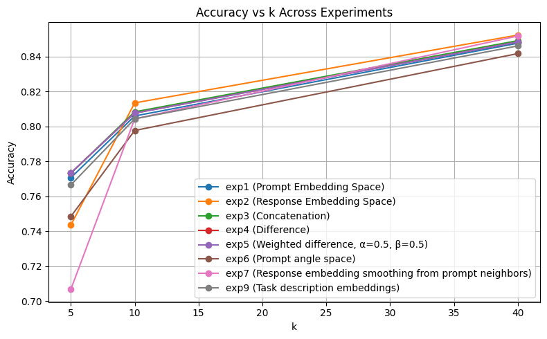
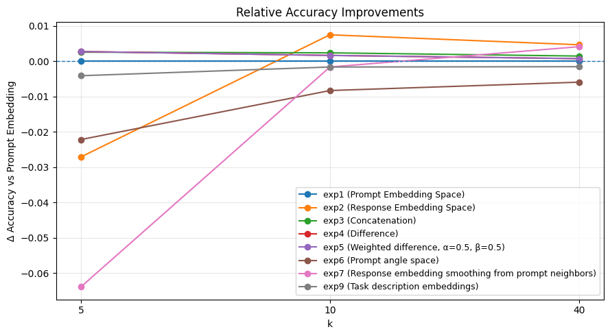

# Evaluating Embeddings in RouterBench

## Project Overview

This project extends [RouterBench](https://arxiv.org/abs/2403.12031) by evaluating different strategies for using embeddings to route a given prompt to the most appropriate model. The goal is to explore whether embeddings—of the prompt, the model's response, or combinations thereof—can help predict which model will perform best on a given task.

RouterBench provides a benchmark of model responses across a diverse set of tasks. This work focuses on **embedding-based routing**, i.e., mapping prompts (or derived representations) into a feature space and using similarity metrics to guide model selection.

## Setup

To get started, please clone the repo and `cd` into that directory.

```bash
# Ensure correct Python version (uses .python-version)
pyenv install 3.11.9
pyenv local 3.11.9

# Create and activate virtual environment
python -m venv venv
source venv/bin/activate

# Install dependencies
pip install -r requirements.txt
```

## Motivation

In multi-model systems, selecting the optimal model for each prompt can improve performance without requiring human intervention. While prior work primarily uses the raw prompt or handcrafted heuristics, we explore:

1. **Prompt embeddings** – capturing semantic content directly from the prompt.
2. **Response embeddings** – capturing what models actually produce.
3. **Combinations or transformations** – including differences, weighted differences, and smoothing over neighbors.
4. **Derived features** – e.g., angular relationships between prompt and response embeddings.

Our experiments ask: *How much information about the task or optimal model is encoded in these embedding spaces, and how can it be exploited for routing?*

## Experiments

Below is a high-level summary of the experiments performed. See the `results` directory for CSV files and figures.

### Experiment 1 – kNN on Prompt Embeddings
- **Concept:** Use embeddings of the prompts directly for nearest-neighbor model selection.
- **Results:** Strong baseline; captures task semantics effectively.

### Experiment 2 – kNN on Response Embeddings
- **Concept:** Use embeddings of the model’s responses instead of prompts.
- **Results:** Slightly better at some k values, but noisy responses can mislead.

### Experiment 3 – Concatenation of Prompt + Response
- **Concept:** Combine prompt and response embeddings into a single feature vector.
- **Results:** Small improvement over individual prompt embeddings (~0.5–1% accuracy gain).

### Experiment 4 – Difference of Prompt and Response Embeddings
- **Concept:** Compute `response_emb - prompt_emb` to capture “information added by the model.”
- **Results:** Minor improvement over concatenation, suggesting some signal in the residual but limited.

### Experiment 5 – Weighted Difference (α·response + β·prompt)
- **Concept:** Explore if weighting the prompt and response differences improves performance.
- **Results:** Negligible improvement over exp4; confirms that simple differences are sufficient in most cases.

### Experiment 6 – Angle Features in Prompt/Response Space
- **Concept:** Use features based on cosine similarity and vector norms to reduce dimensionality.
- **Results:** ~1–2% drop in accuracy compared to full embeddings, highlighting that high-dimensional embeddings encode important information for routing.

### Experiment 7 – Relative Neighborhood Embeddings (Smoothing)
- **Concept:** Replace each evaluation sample’s response embedding with the mean of the reponse embeddings for the k-nearest neighbors with the most similar prompts in the training set, smoothing the embedding space.
- **Results:** Slight gains; the approach captures task-level information beyond individual samples.

### Experiment 9 – Task Description Embeddings
- **Concept:** Generate a brief natural language description of the task and embed that description instead of the full prompt.
- **Results:** Performance comparable to prompt embeddings.

## Summary of Results

Results for exp2 - exp7 are from the MistralAI 7b chat model. For more information about individual model performance, see the 	results.csv` file in those directories.

- **Best performance** was consistently achieved using full response embeddings.
- **Angle-based features** provide interpretable insights but reduce accuracy.
- **Task description embeddings** offer comparable accuracy but require additional generation from an LLM.



Here are the same results using accuracy of routing based on prompt embeddings (experiment 1) as a baseline:



## Conclusions

1. **High-dimensional embeddings matter:** Our attempt to reduce dimensionality by using simplistic transformations degraded accuracy.

2. **Response embeddings add signal** on their own. Our attempts to combine them with prompt embeddings did not result in accuracy gains.

## Future Work

1.	Learned combinations of prompt and response embeddings: Instead of simple addition or weighted differences, a model (e.g., decision tree, small neural network) could learn how to optimally combine prompt and response embeddings for routing. This may outperform using response embeddings alone.

2.	Ensemble-based routing: Rather than directly weighting embeddings, perform routing separately on prompt and response embeddings, identify the top-performing models for each, and combine their predictions to find the model to route to.

3.	Improved task description embeddings: Our experiments used MistralAI Instruct v0.3. Stronger models could plausibly generate higher-quality task descriptions, potentially improving routing accuracy.

## References

1. [RouterBench: Benchmarking Multi-Model Routing](https://arxiv.org/abs/2403.12031)
2. Mikolov et al., *Efficient Estimation of Word Representations in Vector Space*, 2013.
3. Reimers & Gurevych, *Sentence-BERT: Sentence Embeddings using Siamese BERT-Networks*, 2019.
